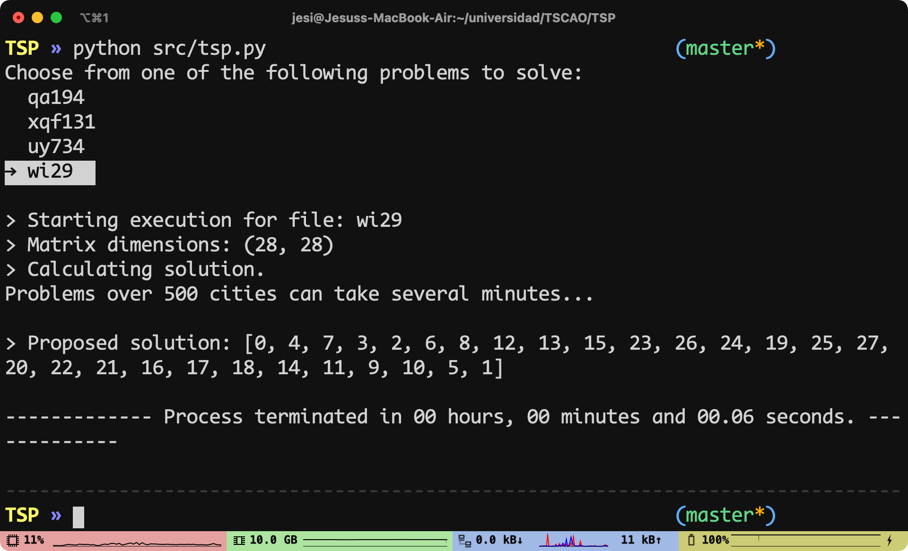
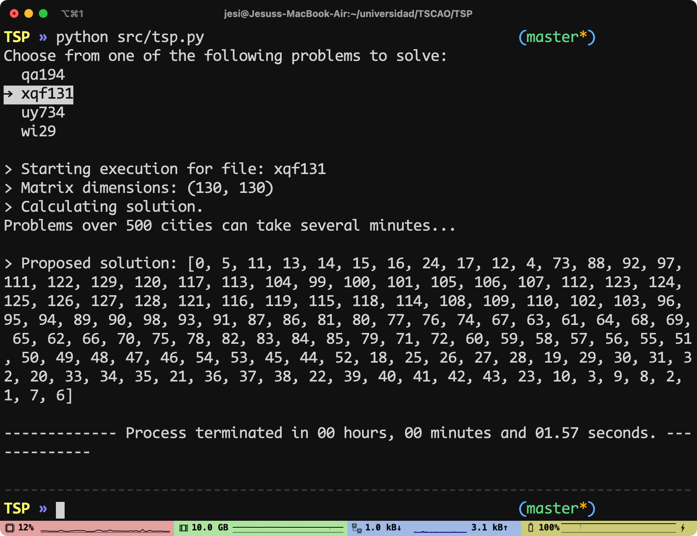

# Traveling Salesman Problem solver

This is a small python script that solves TSP problems.

The data was obtained from the [TSP webpage.](http://www.math.uwaterloo.ca/tsp/data/index.html)

In order to use it, clone this repository and change directory to it. Create a virtual environment and execute a ```pip install -r requirements.txt``` to install the dependencies needed.

Then, execute ```python src/tsp.py```. You will be asked to select what file you want to run the algorithm on.

Here are some screencaps of sample executions:


